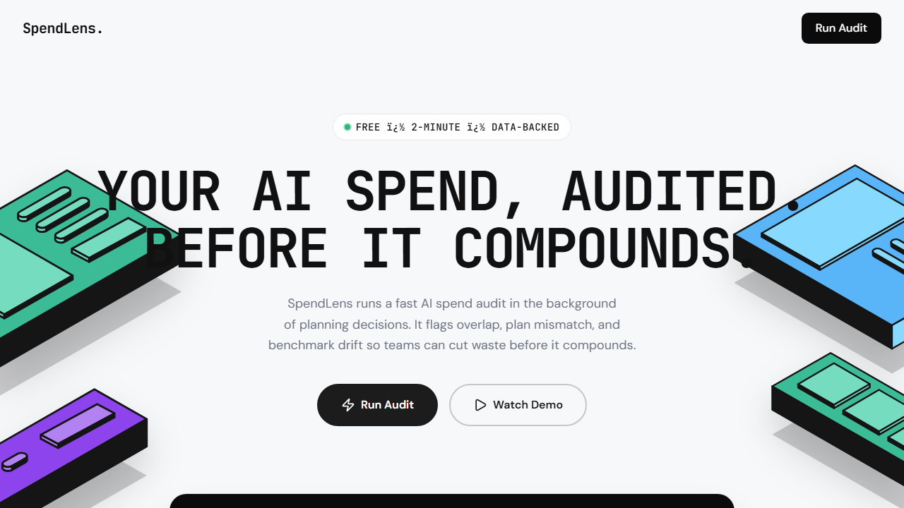
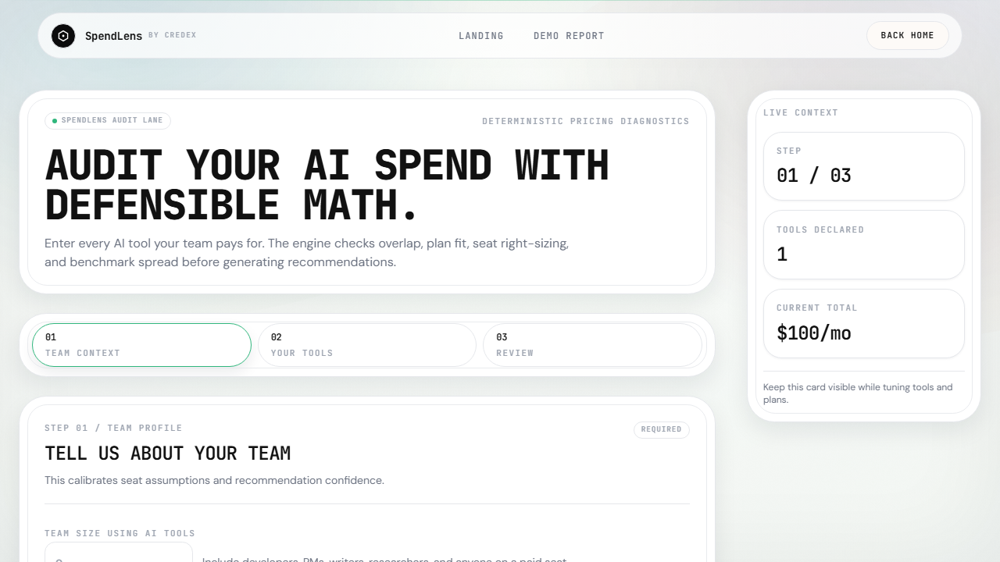
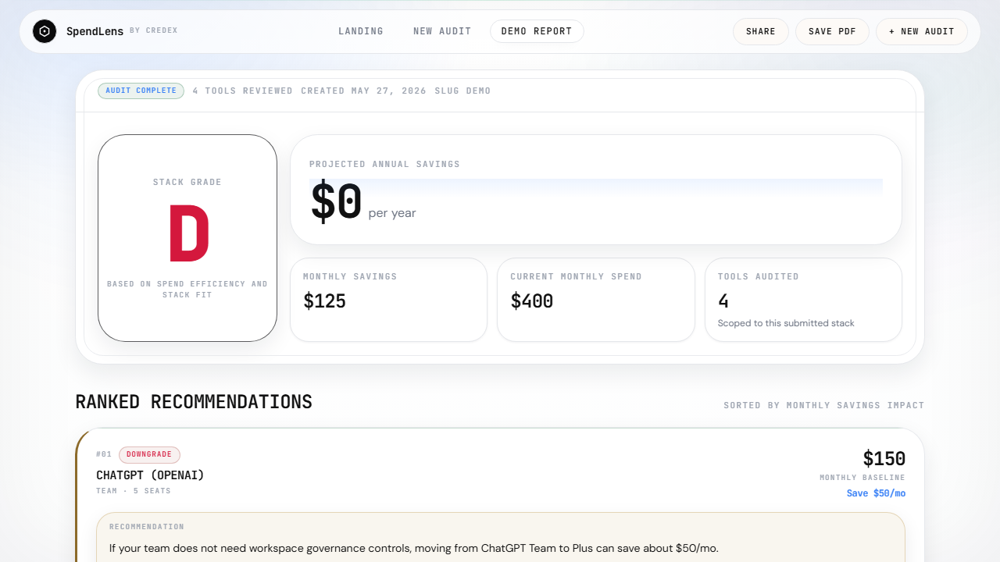

# Credex SpendLens

SpendLens is a deterministic AI tooling spend auditor for startup operators (founders, engineering managers, and finance leads). Users complete a short guided audit and get a defensible report showing overlap, over-seating, and concrete monthly/annual savings opportunities. It is built for teams that need actionable cost decisions quickly without procurement-heavy software.

## Screenshots

### Landing


### Audit Wizard


### Results Report


## Quick Start

### Install

```bash
npm install
```

### Run locally

```bash
cp .env.example .env.local
npm run dev
```

Open:
- `http://localhost:3000`
- `http://localhost:3000/audit`
- `http://localhost:3000/results/demo`

### Deploy (Vercel)

```bash
npm i -g vercel
vercel
vercel --prod
```

Set required environment variables in Vercel project settings from `.env.example` before production deploy.

## Decisions (5 Trade-offs)

1. **Deterministic engine over AI-generated decisions**: recommendation math must be explainable and testable.
2. **Async AI summary with fallback**: report delivery should never block on model latency/failure.
3. **Post-value lead capture**: users see audit value first, then optional email capture.
4. **Supabase with in-memory fallback**: enables fast local iteration without hard blocking on DB availability.
5. **Single product flow over multi-tool complexity**: constrained input model improved completion rate and reduced UX friction.

## Deployed URL

- Add your live URL after deploy (for final submission), for example: `https://<your-project>.vercel.app`

## Quality Checks

```bash
npm run lint
npm run test
npx tsc --noEmit
npm run build
```

## Repo Notes

- Pricing catalog and vendor links: `src/data/pricing.ts` + `PRICING_DATA.md`
- Architecture and data flow: `ARCHITECTURE.md`
- Daily execution log: `DEVLOG.md`
